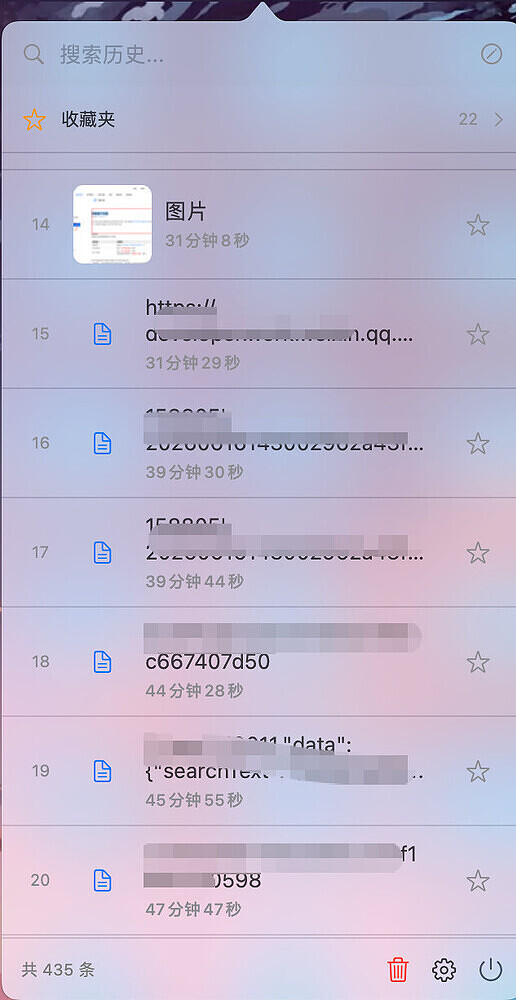
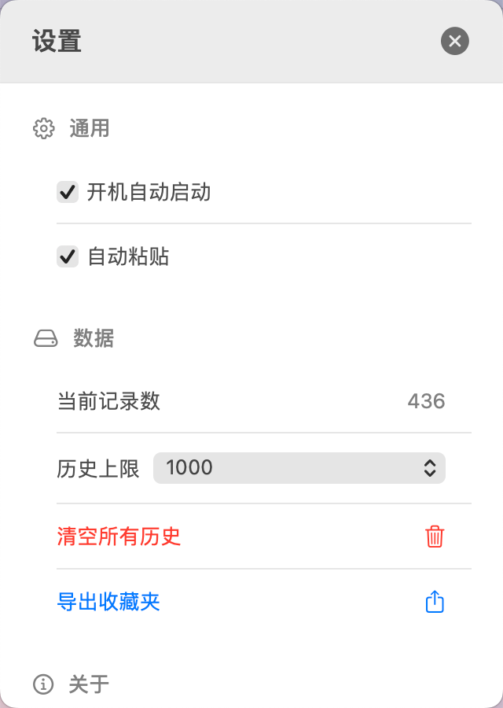

# CopyList

> macOS 剪贴板历史管理工具 — 轻量、高效、开源

[](LICENSE)
[](https://github.com/Mr-Sure/CopyList/releases)
[](https://www.apple.com/macos/)
[](https://swift.org)

一款纯 Swift 原生开发的 macOS 剪贴板管理工具，常驻状态栏，记录你的每一次复制，支持文本、图片、文件三种类型，一键复制 + 自动粘贴，让效率翻倍。

## ✨ 功能特性

| 功能 | 说明 |
|------|------|
| 📋 历史记录 | 支持文本、图片、文件，SQLite 永久保存 |
| ⭐ 收藏夹 | 常用内容一键收藏，永久保存至手动删除 |
| 🏷️ 标签管理 | 为收藏项添加标签，分类筛选；行内折叠展示 + hover 展开全部 |
| 🔍 搜索过滤 | 按类型、关键词快速检索，**正文与标签同时匹配** |
| 🎯 自动粘贴 | 点击即复制+粘贴（需辅助功能权限） |
| 🚀 开机自启 | 随系统启动，无感运行 |
| 🗑️ 内容去重 | 相同内容自动合并，不占空间 |
| 💾 自动备份 | 收藏夹每小时自动备份 |
| 🗃️ 本地数据库 | 历史按页加载，海量记录也保持流畅 |
| 📤 导出功能 | 一键导出收藏夹为 JSON |
| 🔄 自动更新 | 应用内检查新版本，一键下载 |
| 🧠 内存优化 | NSCache LRU 淘汰 + 内存压力响应 |

## 📸 截图预览

<p align="left">
   
</p>

<p align="left">
  
</p>

## 📥 安装方式

### 方式一：下载 DMG（推荐）

前往 [Releases](https://github.com/Mr-Sure/CopyList/releases) 页面下载最新版 `CopyList.dmg`，双击打开后将 `CopyList.app` 拖入 `Applications` 文件夹。

### 方式二：从源码编译

```bash
# 克隆仓库
git clone https://github.com/Mr-Sure/CopyList.git
cd CopyList

# 运行构建脚本（自动编译、打包、安装）
bash Scripts/build.sh
```

## 🔧 系统要求

- **macOS 13.0** 或更高版本
- 自动粘贴功能需要授予**辅助功能权限**（首次启动时引导）

## 📖 使用说明

1. **启动**：安装后打开 CopyList，状态栏会出现剪贴板图标
2. **复制**：正常使用 Cmd+C 复制任何内容，CopyList 自动记录
3. **粘贴**：点击状态栏图标 → 点击历史项 → 自动粘贴到当前应用
4. **收藏**：点击 ⭐ 按钮收藏重要内容
5. **搜索**：在搜索框输入关键词过滤历史
6. **设置**：点击齿轮图标配置自动粘贴、历史上限等

## 🔨 构建说明

项目使用 `build.sh` 一键构建，完整流程：

```
版本自动递增 → Swift 编译 → 代码签名 → DMG 打包 → Git 提交 → GitHub Release
```

### 签名证书（推荐先执行一次）

构建脚本优先使用固定自签名证书 `CopyListDev` 签名，固定的签名身份让**版本更新后辅助功能等系统授权自动保留**（ad-hoc 签名每次构建身份都变，更新即丢失授权）：

```bash
# 首次构建前运行一次（有效期 10 年，过程中如弹出钥匙串确认框请允许）
bash Scripts/create-signing-cert.sh
```

证书缺失时构建脚本会自动回退 ad-hoc 签名并提示。换机迁移请从「钥匙串访问」导出含私钥的 `CopyListDev.p12` 备份。

### 手动编译

```bash
swiftc -parse-as-library \
  -o CopyList.app/Contents/MacOS/CopyList \
  Sources/App/ClipboardApp.swift \
  Sources/Core/ClipboardManager.swift \
  Sources/Core/ClipboardStore.swift \
  Sources/Core/UpdateChecker.swift \
  Sources/Views/PopoverView.swift \
  Sources/Views/SettingsView.swift \
  Sources/Views/MainWindowView.swift \
  -framework SwiftUI \
  -framework AppKit \
  -framework ServiceManagement \
  -framework CoreGraphics \
  -framework ImageIO \
  -framework UniformTypeIdentifiers \
  -lsqlite3
```

### DMG 打包

```bash
hdiutil create -volname "CopyList" -srcfolder CopyList.app -ov -format UDZO CopyList.dmg
```

## 🔐 权限说明

| 权限 | 用途 | 是否必须 |
|------|------|----------|
| 辅助功能 | 自动粘贴（模拟 Cmd+V） | 可选 |

详见：
- [开启自动粘贴权限](Docs/开启自动粘贴权限.md)
- [重置辅助功能权限](Docs/重置辅助功能权限.md)

## 📂 项目结构

```
CopyList/
├── Sources/                    # 源代码
│   ├── App/                    # 应用入口
│   │   └── ClipboardApp.swift  # AppDelegate & 应用生命周期
│   ├── Core/                   # 核心业务逻辑
│   │   ├── ClipboardManager.swift # 剪贴板监控、存储、缓存
│   │   └── UpdateChecker.swift    # 版本更新检查
│   └── Views/                  # 视图层
│       ├── PopoverView.swift   # 状态栏弹出窗口
│       ├── SettingsView.swift  # 设置界面
│       └── MainWindowView.swift # 主窗口（备用）
├── Resources/                  # 资源文件
│   ├── Info.plist              # 应用配置
│   ├── CopyList.entitlements   # 权限声明
│   ├── AppIcon.iconset/        # 应用图标
│   └── statusbar_icon.png      # 状态栏图标
├── Scripts/                    # 构建脚本
│   ├── build.sh                # 自动化构建（含固定证书签名与回退）
│   ├── create-signing-cert.sh  # 创建/检查自签名代码签名证书
│   └── watch_logs.sh           # 日志监控
├── Docs/                       # 文档
│   ├── wechat_qrcode.jpg       # 公众号二维码
│   ├── 开启自动粘贴权限.md      # 权限引导
│   └── 重置辅助功能权限.md      # 权限重置引导
├── README.md                   # 项目说明
└── LICENSE                     # MIT 许可证
```

## 📋 更新日志

### v1.3.23 (2026-09-06)
- 修复：**搜索支持标签** — 此前搜索只匹配剪贴板正文，现在**正文或标签命中都会返回**（如某条记录打了"安全"标签，搜索"安全"即可找到，即使正文里没有这两个字）
- 优化：**标签展示重构** — 行内最多显示 2 个标签胶囊，超出折叠为 `+N` 徽标；长标签自动截断，不再挤爆时间戳行
- 新增：hover 时间戳行**原地展开完整标签流**（流式换行，最多 9 个 + `+N`），预览文本自动缩为一行补偿高度，移开后自动收回
- 改进：改用**固定自签名证书**（CopyListDev）签名 — 本次更新后重新授权一次辅助功能，**此后所有版本更新不再需要重复授权**
- 开发者：新增 `Scripts/create-signing-cert.sh` 一键创建/检查签名证书；构建脚本证书缺失时自动回退 ad-hoc 并提示；Release tag 包含完整源码

### v1.3.22 (2026-09-05)
- 新增：内容去重 — 同一段文本重复复制不再新增冗余记录，仅刷新时间戳与复制次数
- 新增：图片按内容指纹去重 — 同一张图片反复复制不再落盘新文件，减轻存储占用
- 优化：GIF 动图保留原始字节，从浏览器等复制 GIF 不再被强制转成静态 PNG
- 修复：搜索对 `%`、`_`、`\` 等特殊字符按字面匹配，避免搜索误导
- 修复：阻止包含引号/反斜杠的标签破坏数据与匹配
- 优化：编辑成重复内容时合并收藏/次数/标签，不丢失任何用户数据
- 优化：历史上限清理绝不触碰收藏记录，也不误删仍被引用的图片文件
- 修复：数据库损坏时自动隔离为 `.corrupt` 备份再重建，保留坏文件供人工恢复
- 修复：筛选标签被移除时自动退出筛选，避免列表"隐形筛选"莫名变空
- 优化：升级时自动清理旧版 AppleScript 登录项，避免双重自启
- 优化：自动粘贴默认值同步（一次性迁移，老用户升级自动保持原有行为）

### v1.3.21 (2026-07-10)
- 重构：点击记录后的状态复位收敛为 `onSelect` 回调，搜索词/收藏夹/标签筛选统一恢复默认视图
- 文档：README 更新日志同步

### v1.3.18 (2026-06-26)
- 修复：搜索状态未重置的 Bug
  - 问题：搜索并点击记录后，再次打开 Popover 仍显示上次的搜索关键词和过滤结果
  - 修复：选中记录后自动清空搜索框、重置收藏/标签筛选状态，恢复到初始默认视图
  - 同步修复 MainWindowView 中右键复制后搜索框未清空的问题

### v1.3.16 (2026-06-26)
- 工程：搜索粘贴修复源码正式入库并同步 README（无新增用户可见变更）

### v1.3.13 (2026-06-17)
- 修复：彻底解决搜索后点击记录无法自动粘贴和关闭 Popover 的问题
  - 根因：`allowPasteThisTime` + `shouldPaste` 机制存在设计缺陷，搜索输入后标志被置为 false 且无法恢复
  - 修复：移除冗余的 `allowPasteThisTime` 机制，ItemRow 直接从 AppStorage 读取 `enableAutopaste` 开关
  - 优化：清理死代码，简化粘贴判断逻辑

### v1.3.10 (2026-06-17)
- 修复：尝试修复搜索后点击记录无法自动粘贴的问题（初次修复不完整）

### v1.3.9 (2026-06-16)
- 新增：设置「关于」区块展示作者信息（作者、邮箱、GitHub）
- 邮箱点击调用系统邮件客户端，GitHub 点击打开作者主页

### v1.3.7 (2026-06-16)
- 修复：更新检查功能分支名称错误（main → master）

### v1.3.5 (2026-06-16)
- 重构：项目目录工程化改造
  - Sources/ — 源代码（App/Core/Views）
  - Resources/ — 资源文件
  - Scripts/ — 构建脚本
  - Docs/ — 文档
- 优化：build.sh 适配新目录结构

### v1.3.2 (2026-06-16)
- 新增：GitHub 自动化 Release 发布
- 新增：构建时自动检测代码变更并递增版本号
- 新增：设置界面动态显示版本号和构建时间
- 新增：设置内检查更新按钮
- 修复：更新检查 task 未启动的问题
- 优化：每 5 分钟自动清理图片缓存，降低内存占用
- 优化：Popover 关闭时自动落盘待写数据

### v1.2.1 (2025-06-11)
- 修复：自动粘贴功能恢复正常
- 修复：窗口崩溃问题
- 新增：收藏夹自动备份（每小时，保留 10 个）
- 新增：一键导出收藏夹为 JSON
- 新增：代码签名支持，辅助功能权限持久化
- 新增：build.sh 自动构建脚本
- 优化：回退到稳定的 Popover 窗口设计

### v1.2.0 (2025-06-11)
- 新增：右键删除单条记录
- 新增：收藏夹标签功能（添加/移除/筛选）
- 新增：标签可视化显示
- 优化：删除操作无需二次确认

### v1.1.0 (2025-06-11)
- 新增：开机自动启动功能
- 新增：自动粘贴开关
- 新增：内容自动去重
- 优化：商业级设置界面

### v1.0.0 (2025-06-11)
- 初始版本发布

## 👤 作者

**Sure**

- 📧 Email: sure@tuiyilin.com
- 🌐 GitHub: [Mr-Sure](https://github.com/Mr-Sure)

<p>关注公众号，获取更多工具推荐和技术分享：</p>

<p align="left">
  
</p>

## 🔗 友链

- [LINUX DO](https://linux.do) — 新的理想型社区
- [心心念念日](https://days.bettersun.cn) — 纪念日管理

## 📄 许可证

本项目采用 [MIT License](LICENSE) 开源。

---

<p align="center">
  如果这个项目对你有帮助，请给一个 ⭐️ Star 支持！
</p>
